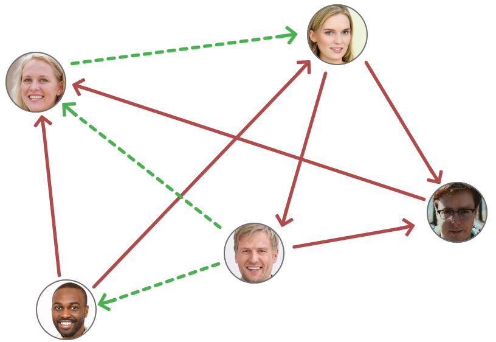
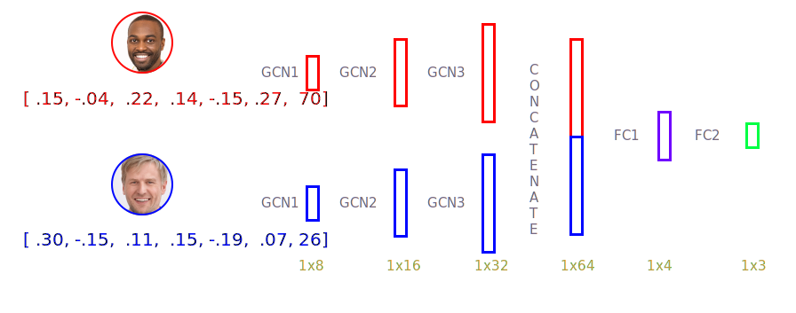

# Graph Chess

This is an attempt to predict the result of a game of chess between any 2 player given their previous match history <br>

This repository contains:

1. [The dataset](out.txt) and its [readme](README.chess)
2. The python [code](GrandMaster.py)
3. The generated [graph](graph.png)
4. And a few other ReadMe related files


## Table of Contents

- [Dataset](#dataset)
- [Mini Example](#mini-example)
- [Model Architecture](#model-architecture)
- [To Run](#to-run)
- [Future Work](#future-work)
- [Citation](#citation)


## Dataset

The dataset used in this repo is the [Chess network, part of the Koblenz Network Collection](http://konect.cc/networks/chess/). They are results of chess games.  Each node is a chess player, and a directed edge represents a game, with the white player having an outgoing edge and the black player having an ingoing edge.  The weight of the edge represents the outcome (+1 white won, 0 draw, −1 black won).  The dataset is anonymous:  the identity of the players is unknown, and timestamps are approximate.  Timestamps are given to a one month precision, and may have been shifted towards the future by an unknown amount.
<br>
### Statistics of the dataset
1. **Total number of nodes (players):** 7301 <br>
2. **Total number of edges (matches):** 65053 <br>
3. **Average node degree:** 17.82 <br>
4. **Percentage of white wins:** 32.53 % <br>
5. **Percentage of black wins:** 23.40 % <br>
6. **Percentage of draws:** 44.06 % <br>

**The generated graph:** 
<br>


## Mini Example
Consider the below example, where the 5 players form the nodes, and the edges representing a game played between them. <br>
 

The red directed line between 2 players represents a game of chess, where the player having an outgoing edge is white and the player having an incoming edge plays black. The task is, given the results of the played matches, to predict the outcome of the green lines.  This is an edge classification task, where an edge has to be classified as either -1 or 0 or 1


## Model Architecture
The following is the overview of the used model
<br>


Optimizer: Adam with learning rate = 0.01 <br>
Loss Function: Cross Entropy Loss <br>
Apart from the last layer where Softmax was used, ReLU was used between all layers

Model parameters: Weights of model, Edge weights

## To Run

Download the following files in a same directory

```
grandmaster.py
out.txt
```
and make sure you have the following libraries installed.
```
torch
torch_geometric
numpy
pandas
```
Run grandmaster.py 
```
cd directory-where-the-files-are-saved
python3 grandmaster.py
```
## Future Work
The problem that was encountered while building the graph network was the inability to differentiate the win and loss edges via positive and negative edge weights. This is important because if all the edge weights are positive then there would be no difference between a winning directed edge and a lossing directed edge. None of the present (Jun 2021) graph neural algorithms support negative edge weights, and if in future any algorithm with this ability is introduced, it may be used to experiment on this datasset.

## Citation
```
@MISC{konect:2017:chess,
    title = {Chess network dataset -- {KONECT}},
    month = oct,
    year = {2017},
    url = {http://konect.cc/networks/chess}
}
```
